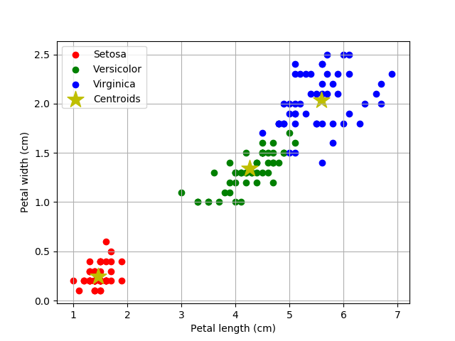

# Basic Machine Learning Using Sklearn Tutorial

### __11. K-Means__ (📂[_click to go to its repo_](https://github.com/LintangWisesa/Sklearn_Tutorial_Youtube/tree/master/11%20K-Means))

[](https://www.youtube.com/watch?v=xpEib9mhI1o)

```python
import numpy as np
import pandas as pd
import matplotlib.pyplot as plt
from sklearn.datasets import load_iris

dataIris = load_iris()
# print(dir(dataIris))

# create dataframe
dfIris = pd.DataFrame(
    dataIris['data'],
    columns = ['sepalL', 'sepalW', 'petalL', 'petalW']
)
dfIris['target'] = dataIris['target']
dfIris['spesies'] = dfIris['target'].apply(
    lambda x: dataIris['target_names'][x]
)

# separate dataframe by spesies
dfSetosa = dfIris[dfIris['target'] == 0]
dfVersicolor = dfIris[dfIris['target'] == 1]
dfVirginica = dfIris[dfIris['target'] == 2]

from sklearn.cluster import KMeans

# cari jumlah cluster terbaik (n_clusters)
# sum square error
# data = []
# for i in range(1, 11):
#     model = KMeans(n_clusters=i)
#     model.fit(dfIris[['petalL', 'petalW']])
#     data.append(model.inertia_)

# # elbow method
# plt.plot(np.arange(1, 11), data, 'r-')
# plt.xlabel('Range Cluster')
# plt.ylabel('Sum square error')
# plt.grid(True)
# plt.show()

# model K-means
# from sklearn.cluster import KMeans
model = KMeans(n_clusters = 3)

# training
model.fit(dfIris[['petalL', 'petalW']])

# centroid
centroid = model.cluster_centers_
print(centroid)

# plot
plt.scatter(dfSetosa['petalL'], dfSetosa['petalW'], color='r')
plt.scatter(dfVersicolor['petalL'], dfVersicolor['petalW'], color='g')
plt.scatter(dfVirginica['petalL'], dfVirginica['petalW'], color='b')
plt.scatter(centroid[:,0], centroid[:,1], marker='*', color='y', s=300)

plt.legend(['Setosa', 'Versicolor', 'Virginica', 'Centroids'])
plt.xlabel('Petal length (cm)')
plt.ylabel('Petal width (cm)')
plt.grid(True)
plt.show()

print(model.predict([[4.5, 5.4]]))
```



#

#### Lintang Wisesa :love_letter: _lintangwisesa@ymail.com_

[Facebook](https://www.facebook.com/lintangbagus) | 
[Twitter](https://twitter.com/Lintang_Wisesa) |
[Google+](https://plus.google.com/u/0/+LintangWisesa1) |
[Youtube](https://www.youtube.com/user/lintangbagus) | 
:octocat: [GitHub](https://github.com/LintangWisesa) |
[Hackster](https://www.hackster.io/lintangwisesa)