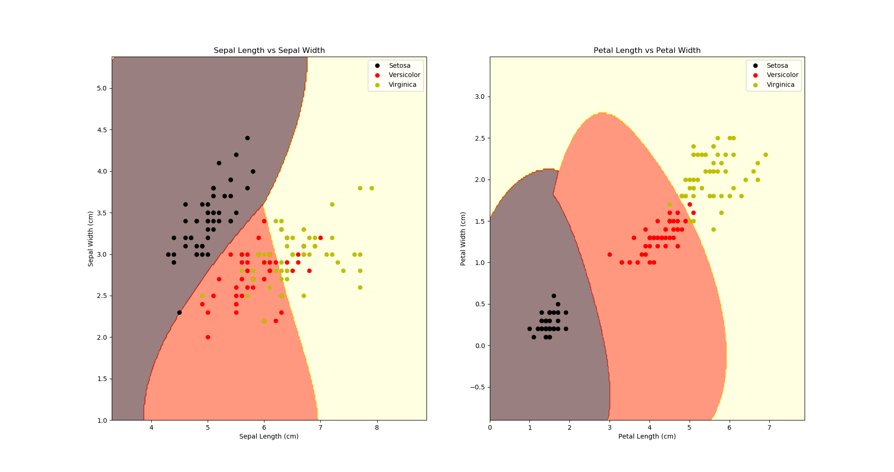

# Basic Machine Learning Using Sklearn Tutorial

### __12. Support Vector Machine__ (📂[_click to go to its repo_](https://github.com/LintangWisesa/Sklearn_Tutorial_Youtube/tree/master/12%20Support%20Vector%20Machine))

[](https://www.youtube.com/watch?v=CNtfHFAb4l0)

```python
import numpy as np
import pandas as pd
import matplotlib.pyplot as plt
from sklearn.datasets import load_iris

dataIris = load_iris()
df = pd.DataFrame(
    dataIris['data'],
    columns = ['SL', 'SW', 'PL', 'PW']
)
df['target'] = dataIris['target']
df['spesies'] = df['target'].apply(
    lambda row: dataIris['target_names'][row]
)

# SVM
from sklearn.svm import SVC
modelS = SVC(gamma = 'auto', probability = True)
modelP = SVC(gamma = 'auto', probability = True)

sepal = dataIris['data'][:, :2]
sl, sw = sepal[:, 0], sepal[:, 1]
petal = dataIris['data'][:, 2:]
pl, pw = petal[:, 0], petal[:, 1]

modelS.fit(sepal, dataIris['target'])
modelP.fit(petal, dataIris['target'])

def mgrid(x, y):
    x_min = x.min() - 1
    x_max = x.max() + 1
    y_min = y.min() - 1
    y_max = y.max() + 1
    xx, yy = np.meshgrid(
        np.arange(x_min, x_max, .02),
        np.arange(y_min, y_max, .02)
    )
    return xx, yy

sl, sw = mgrid(sl, sw)
pl, pw = mgrid(pl, pw)
# print(sl)
# print(sw)

# function plotting
def svmplot(axisfig, model, length, width):
    p = model.predict(np.c_[length.ravel(), width.ravel()])
    p = p.reshape(length.shape)
    hasil = axisfig.contourf(
        length, width, p, cmap='hot', alpha=.5
    )
    return hasil

fig = plt.figure('SVM', figsize=(12,6))

# plot sl vs sw
ax = plt.subplot(121)
svmplot(ax, modelS, sl, sw)
plt.plot(
    df[df['target'] == 0]['SL'],
    df[df['target'] == 0]['SW'],
    'ko'
)
plt.plot(
    df[df['target'] == 1]['SL'],
    df[df['target'] == 1]['SW'],
    'ro'
)
plt.plot(
    df[df['target'] == 2]['SL'],
    df[df['target'] == 2]['SW'],
    'yo'
)
plt.xlabel('Sepal Length (cm)')
plt.ylabel('Sepal Width (cm)')
plt.legend(['Setosa', 'Versicolor', 'Virginica'])
plt.title('Sepal Length vs Sepal Width')

# plot pl vs pw
ax = plt.subplot(122)
svmplot(ax, modelP, pl, pw)
plt.plot(
    df[df['target'] == 0]['PL'],
    df[df['target'] == 0]['PW'],
    'ko'
)
plt.plot(
    df[df['target'] == 1]['PL'],
    df[df['target'] == 1]['PW'],
    'ro'
)
plt.plot(
    df[df['target'] == 2]['PL'],
    df[df['target'] == 2]['PW'],
    'yo'
)
plt.xlabel('Petal Length (cm)')
plt.ylabel('Petal Width (cm)')
plt.legend(['Setosa', 'Versicolor', 'Virginica'])
plt.title('Petal Length vs Petal Width')

plt.show()
```



#

#### Lintang Wisesa :love_letter: _lintangwisesa@ymail.com_

[Facebook](https://www.facebook.com/lintangbagus) | 
[Twitter](https://twitter.com/Lintang_Wisesa) |
[Google+](https://plus.google.com/u/0/+LintangWisesa1) |
[Youtube](https://www.youtube.com/user/lintangbagus) | 
:octocat: [GitHub](https://github.com/LintangWisesa) |
[Hackster](https://www.hackster.io/lintangwisesa)