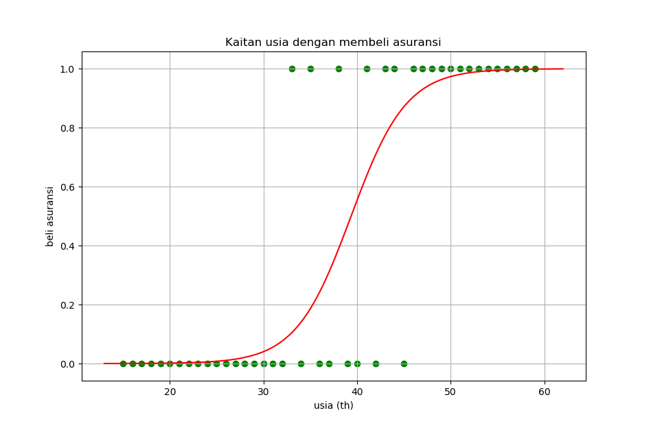

# Basic Machine Learning Using Sklearn Tutorial

### __4. Logistic Regression__ (📂[_click to go to its repo_](https://github.com/LintangWisesa/Sklearn_Tutorial_Youtube/tree/master/4%20Logistic%20Regression))

[](https://www.youtube.com/watch?v=pYq3wtTc9eo)

```python
import numpy as np
import pandas as pd
import matplotlib.pyplot as plt

df = pd.read_excel('data.xlsx')
# print(df)

# plotting
# plt.scatter(
#     df['usia'],
#     df['beliAsuransi'],
#     marker = 'o',
#     color = 'g'
# )
# plt.xlabel('usia (th)')
# plt.ylabel('beli asuransi')
# plt.title('Kaitan usia dengan membeli asuransi')
# plt.grid(True)
# plt.show()

# splitting datasets: 90% training data & 10% test data
from sklearn.model_selection import train_test_split
x_train, x_test, y_train, y_test = train_test_split(
    df[['usia']],
    df['beliAsuransi'],
    test_size = .1
)
# print(x_train)
# print(x_test)

# logistic regression
from sklearn.linear_model import LogisticRegression
model = LogisticRegression(solver = 'lbfgs')

# training
model.fit(x_train, y_train)

# accuracy
print(model.score(x_test, y_test) * 100, '%')

# prediction: kira2 usia seseorang 32/43/55, apakah akan beli asuransi?
print(model.predict([[ 32 ]]))
# print(model.predict([[ 43 ]]))
# print(model.predict([[ 55 ]]))

# probability: kemungkinan
print(model.predict_proba([[ 32 ]]))
# print(model.predict_proba([[ 43 ]]))
# print(model.predict_proba([[ 55 ]]))

# plotting dataframe
plt.scatter(
    df['usia'],
    df['beliAsuransi'],
    marker = 'o',
    color = 'g'
)

# plotting best fit line
m = model.coef_
b = model.intercept_
x = np.linspace(13, 62, 150)

# linear regression: y = mx + b
# logistic regression: y = 1 / (1 + e^(- mx + b))

def plotBest(garis):
    return 1 / (1 + np.exp(-garis))
bestFit = plotBest(m * x + b).ravel()

plt.plot(
    x,
    bestFit,
    'r-'
)

plt.xlabel('usia (th)')
plt.ylabel('beli asuransi')
plt.title('Kaitan usia dengan membeli asuransi')
plt.grid(True)
plt.show()
```



#

#### Lintang Wisesa :love_letter: _lintangwisesa@ymail.com_

[Facebook](https://www.facebook.com/lintangbagus) | 
[Twitter](https://twitter.com/Lintang_Wisesa) |
[Google+](https://plus.google.com/u/0/+LintangWisesa1) |
[Youtube](https://www.youtube.com/user/lintangbagus) | 
:octocat: [GitHub](https://github.com/LintangWisesa) |
[Hackster](https://www.hackster.io/lintangwisesa)