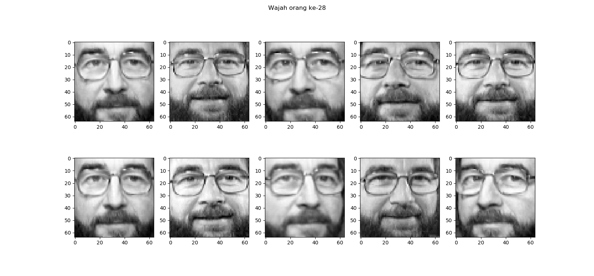

# Basic Machine Learning Using Sklearn Tutorial

### __How to Read Sklearn Datasets__ (📂[_click to go to its repo_](https://github.com/LintangWisesa/Sklearn_Tutorial_Youtube/tree/master/5%20Sklearn%20Datasets))

### 5. Toy Datasets: Iris Dataset

[](https://www.youtube.com/watch?v=9thqvfq22q0)

```python
import numpy as np
import pandas as pd
import matplotlib.pyplot as plt
from sklearn.datasets import load_iris

dataIris = load_iris()
print(dir(dataIris))

# create dataframe
dfIris = pd.DataFrame(
    dataIris['data'],
    columns = ['sepalL', 'sepalW', 'petalL', 'petalW']
)
dfIris['target'] = dataIris['target']
dfIris['spesies'] = dfIris['target'].apply(
    lambda x: dataIris['target_names'][x]
)
# print(dfIris[dfIris['target'] == 2])

# separate dataframe by spesies
dfSetosa = dfIris[dfIris['target'] == 0]
dfVersicolor = dfIris[dfIris['target'] == 1]
dfVirginica = dfIris[dfIris['target'] == 2]

# plot by sepal length vs sepal width
fig = plt.figure('Data Iris', figsize = (12,6))

# plot sepal
plt.subplot(121)
plt.scatter(
    dfSetosa['sepalL'],
    dfSetosa['sepalW'],
    marker = 'o',
    color = 'r'
)
plt.scatter(
    dfVersicolor['sepalL'],
    dfVersicolor['sepalW'],
    marker = 'o',
    color = 'g'
)
plt.scatter(
    dfVirginica['sepalL'],
    dfVirginica['sepalW'],
    marker = 'o',
    color = 'y'
)
plt.xlabel('Sepal Length (cm)')
plt.ylabel('Sepal Width (cm)')
plt.title('Sepal length vs sepal width')
plt.legend(['Setosa', 'Versicolor', 'Virginica'])
plt.grid(True)

# plot petal
plt.subplot(122)
plt.scatter(
    dfSetosa['petalL'],
    dfSetosa['petalW'],
    marker = 'o',
    color = 'r'
)
plt.scatter(
    dfVersicolor['petalL'],
    dfVersicolor['petalW'],
    marker = 'o',
    color = 'g'
)
plt.scatter(
    dfVirginica['petalL'],
    dfVirginica['petalW'],
    marker = 'o',
    color = 'y'
)
plt.xlabel('Petal Length (cm)')
plt.ylabel('Petal Width (cm)')
plt.title('Petal length vs petal width')
plt.legend(['Setosa', 'Versicolor', 'Virginica'])
plt.grid(True)

plt.show()
```


#

### 6. Real World Datasets: Olivetti Faces Dataset

[](https://www.youtube.com/watch?v=YptG_4E0UEI)

```python
import numpy as np
import pandas as pd
import matplotlib.pyplot as plt
from sklearn.datasets import fetch_olivetti_faces

faces = fetch_olivetti_faces()
print(dir(faces))

# plot orang ke-x
fig = plt.figure('Wajah', figsize=(14,7))
for x in range(10):
    orangke = 28
    plt.subplot(2,5,x+1)
    plt.imshow(faces['images'][x + (10 * (orangke-1))], cmap='gray')
    plt.suptitle('Wajah orang ke-{}'.format(orangke))

plt.show()
```



#

#### Lintang Wisesa :love_letter: _lintangwisesa@ymail.com_

[Facebook](https://www.facebook.com/lintangbagus) | 
[Twitter](https://twitter.com/Lintang_Wisesa) |
[Google+](https://plus.google.com/u/0/+LintangWisesa1) |
[Youtube](https://www.youtube.com/user/lintangbagus) | 
:octocat: [GitHub](https://github.com/LintangWisesa) |
[Hackster](https://www.hackster.io/lintangwisesa)